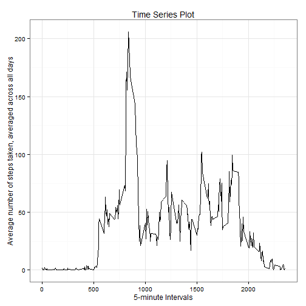

# Reproducible Research: Peer Assessment 1


## Loading and preprocessing the data

Here, we are loading the data from activity.csv into act


```r
act <- read.csv("activity.csv")
```

Now, we are processing the data so that the date column are treated as date


```r
act <-  transform(act, as.Date(act$date,format = "%Y-%m-%d"))
```

## What is mean total number of steps taken per day?

Here, we are aggregating the total number of steps taken per day by 
taking the sum and ignoring the NA values


```r
totalSteps <- aggregate(list(Total_Steps = act$steps), 
                           by = list(Date = act$date), 
                           FUN = sum1 <- function(...){
                               sum(...,na.rm = TRUE)
                           })
```

Now, we shall make a histogram of the total number of steps taken each day


```r
hist(totalSteps$Total_Steps, breaks = 60,
     main = "Total Steps per day", 
     xlab = "Total Steps per Day")
```

 

Now, computing the mean and median of the total number of steps taken per day


```r
meanSteps <- mean(totalSteps$Total_Steps, na.rm = TRUE)
medianSteps <- median(totalSteps$Total_Steps,na.rm = TRUE)
```

The mean total number of steps taken per day is 9354.2295.  
The median total number of steps taken per day is 10395.

## What is the average daily activity pattern?

We shall make a time series plot (i.e.  type = "l" ) of the 5-minute 
interval (x-axis) and the average number of steps taken, averaged 
across all days (y-axis).


```r
# computing the average number of steps taken, averaged across all days, 
# for each interval

avgIntervalSteps <- aggregate(list(Avg_Steps = act$steps), 
                           by = list(Interval = act$interval), 
                           FUN = mean1 <- function(...){
                               mean(...,na.rm = TRUE)
                           })

# plotting using ggplot2 plotting system

library(ggplot2)
g <- ggplot(avgIntervalSteps,aes(Interval,Avg_Steps))
g + geom_line() + theme_bw() + 
    labs(title = "Time Series Plot", 
         x = "5-minute Intervals", 
         y = "Average number of steps taken, averaged across all days")
```

 

Now, we shall find the 5-minute interval, on average across all the days in the dataset, which contains the maximum number of steps.


```r
# finding out the index of maximum value of Avg_Steps in avgIntervalSteps and using this to get the value of Interval

maxInterval <- avgIntervalSteps[which.max(avgIntervalSteps$Avg_Steps),1]
```

According to the plot shown above, the 5-minute interval, on average across all the days in the dataset, which contains the maximum number of steps is 835.

## Imputing missing values

First, we shall find out the total number of missing values in the dataset, i.e.
the total number of rows with NA's.


```r
# computing the number of rows which has NA value in steps
totalNArows <- nrow(act[is.na(act$steps),])
```

The total number of missing values in the dataset is 2304.  
  
We shall make a new dataset where the missing data will be filled in by the mean number of steps for that 5-minute interval, averaged over all days. 


```r
# here we make a new dataset called completeDataset where missing values 
# will be filled in based on the average number of steps taken in that 
# interval over all days

completeDataset <- act
for(i in seq_len(nrow(completeDataset))){
    if(is.na(completeDataset$steps[i])){
        for(j in seq_len(nrow(avgIntervalSteps))){
            if(completeDataset$interval[i] == avgIntervalSteps$Interval[j]){
                completeDataset$steps[i] = avgIntervalSteps$Avg_Steps[j]
                break
            }
        }
    }
        
}
```

Here, we are aggregating the total number of steps taken per day by 
taking the sum, using the completed dataset.


```r
totalCompSteps <- aggregate(list(Total_Steps = completeDataset$steps), 
                           by = list(Date = completeDataset$date), 
                           FUN = sum1 <- function(...){
                               sum(...,na.rm = TRUE)
                           })
```

Now, we shall make a histogram of the total number of steps taken each day using the completed dataset.


```r
hist(totalCompSteps$Total_Steps, breaks = 60,
     main = "Total Steps per day on Completed Dataset", 
     xlab = "Total Steps per Day")
```

 

Now, computing the mean and median of the total number of steps taken per day using the completed dataset.


```r
meanCompSteps <- mean(totalCompSteps$Total_Steps, na.rm = TRUE)
medianCompSteps <- median(totalCompSteps$Total_Steps,na.rm = TRUE)
```

According to the completed dataset,  
The mean total number of steps taken per day is 1.0766 &times; 10<sup>4</sup>.  
The median total number of steps taken per day is 1.0766 &times; 10<sup>4</sup>.  
  
We clearly observe that the mean and median total number of steps taken per day, as obtained using the dataset with filled missing values, is different from the original data with missing values.  
  
On inputting the missing data using average number od steps per interval, averaged on all days, the mean and median has become same and the distribution of data has somewhat become normalized.

## Are there differences in activity patterns between weekdays and weekends?

Now, we shall create a new factor variable called day in the dataset with the filled-in missing values with two levels - "weekday" and "weekend" indicating 
whether a given date is a weekday or weekend day.


```r
completeDataset$day <- weekdays(as.Date(completeDataset$date))

for(i in seq_len(nrow(completeDataset))){
    if(completeDataset$day[i] %in% c("Saturday","Sunday")){
        completeDataset$day[i] <- "weekend"
    }    
    else{
        completeDataset$day[i] <- "weekday"
    }
}
    
completeDataset <- transform(completeDataset,day = as.factor(day))    
```

Now, we shall make a panel plot containing a time series plot (i.e.  type = "l" ) of the 5-minute interval (x-axis) and the average number of steps taken, averaged across all weekday days or weekend days (y-axis).


```r
# computing the average number of steps taken, averaged across all 
# weekday or weekend days, for each interval

avgIntervalDaySteps <- aggregate(list(Avg_Steps = completeDataset$steps), 
                           by = list(Interval = completeDataset$interval,
                                     Day = completeDataset$day), 
                           FUN = mean1 <- function(...){
                               mean(...,na.rm = TRUE)
                           })

# plotting using ggplot2 plotting system

library(ggplot2)
g <- ggplot(avgIntervalDaySteps,aes(Interval,Avg_Steps))
g + geom_line(color = "blue") + theme_bw() + 
    labs(title = "Time Series Plot Weekday vs. Weekend", 
         x = "Interval", 
         y = "Number of Steps") + 
    facet_grid(Day~.)
```

 
